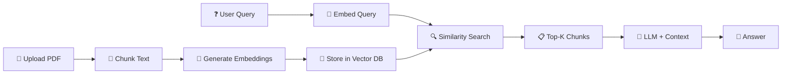

# RAG Document Q&A — Learn by Building

Build a full-stack app where you upload PDFs/documents, and ask questions about them in plain English. You'll learn every RAG concept *by writing the code*, not reading textbooks.

---

## 🏗️ Tech Stack & Why Each Piece Exists

### The RAG Pipeline (What you're actually building)



---

### Stack Breakdown

| Layer | Tool | Why This One |
|-------|------|-------------|
| **Language** | **Python 3.11+** | The AI/ML ecosystem lives in Python. LangChain, LlamaIndex, HuggingFace — all Python-first. No contest here. |
| **RAG Framework** | **LangChain** | Industry-standard orchestration framework. Used at Uber, Elastic, Databricks. Handles the glue between embeddings → vector store → LLM. Alternatives like LlamaIndex exist, but LangChain has the largest community and job market demand. |
| **LLM Provider** | **Google Gemini API** (free tier) | Generous free tier (15 RPM, 1M tokens/day). Competitive quality with GPT-4. No credit card needed to start. We'll structure the code so swapping to OpenAI/Anthropic is a one-line change. |
| **Embeddings** | **Google `text-embedding-004`** | Free with Gemini API. 768-dimensional vectors. Strong multilingual performance. Keeps our API keys simple (one key for both LLM + embeddings). |
| **Vector Database** | **ChromaDB** (local) → **Pinecone/Qdrant** (production) | ChromaDB runs embedded (no server needed), perfect for learning. In production, you'd use Pinecone (managed) or Qdrant (self-hosted). We'll start with Chroma and discuss migration later. |
| **PDF Parsing** | **PyMuPDF (fitz)** | Fastest Python PDF parser. Handles scanned docs, tables, multi-column layouts better than PyPDF2. Used in production at scale. |
| **Text Splitting** | **LangChain RecursiveCharacterTextSplitter** | Splits text intelligently at paragraph/sentence boundaries instead of hard character cuts. Preserves semantic meaning in chunks — critical for retrieval quality. |
| **Backend API** | **FastAPI** | Async, auto-generated OpenAPI docs, type-safe with Pydantic. The standard for Python AI backends. Flask is legacy; FastAPI is what companies hire for. |
| **Frontend** | **Next.js 14 (React)** | Industry standard for production React apps. SSR, API routes, file-based routing. The most in-demand frontend framework on job boards. |
| **File Storage** | **Local filesystem** → **S3/GCS** (production) | Start simple. We'll organize uploaded files locally with metadata, and the architecture makes cloud storage a drop-in replacement. |

---

### Concepts You'll Learn (By Building, Not Reading)

| Concept | How You'll Learn It |
|---------|-------------------|
| **What are embeddings?** | By generating them and visualizing the numbers |
| **What is a vector database?** | By storing embeddings and querying by similarity |
| **What is chunking and why does size matter?** | By experimenting with chunk sizes and seeing answer quality change |
| **What is similarity search?** | By writing cosine similarity from scratch, then using Chroma |
| **What is prompt engineering for RAG?** | By writing the system prompt that combines context + question |
| **What is the retrieval-generation pipeline?** | By building each step individually, then connecting them |
| **What are hallucinations and how RAG reduces them?** | By comparing answers with and without retrieved context |

---

## 📦 Project Structure

```
RAG-prj/
├── backend/
│   ├── app/
│   │   ├── main.py              # FastAPI app entry point
│   │   ├── config.py            # Environment variables & settings
│   │   ├── models/
│   │   │   └── schemas.py       # Pydantic request/response models
│   │   ├── services/
│   │   │   ├── pdf_parser.py    # PDF text extraction
│   │   │   ├── chunker.py       # Text splitting logic
│   │   │   ├── embedder.py      # Embedding generation
│   │   │   ├── vector_store.py  # ChromaDB operations
│   │   │   ├── retriever.py     # Similarity search
│   │   │   └── qa_chain.py      # LLM question-answering
│   │   └── routes/
│   │       ├── upload.py        # Document upload endpoints
│   │       └── query.py         # Q&A endpoints
│   ├── uploads/                 # Stored PDFs
│   ├── chroma_db/               # Vector database storage
│   ├── requirements.txt
│   └── .env                     # API keys
├── frontend/
│   ├── src/
│   │   ├── app/
│   │   │   ├── page.tsx         # Main chat + upload UI
│   │   │   └── layout.tsx       # App layout
│   │   └── components/
│   │       ├── FileUpload.tsx   # Drag & drop upload
│   │       ├── ChatWindow.tsx   # Q&A interface
│   │       ├── DocumentList.tsx # Uploaded docs sidebar
│   │       └── SourceCard.tsx   # Shows retrieved chunks
│   ├── package.json
│   └── .env.local
└── README.md
```

---

## 🚀 Phased Build Plan (5 Phases)

Each phase builds on the previous. Each phase produces a working, runnable thing. No dead theory.

---

### Phase 1: The Core Pipeline (CLI Version)
**Goal**: Upload a PDF → chunk it → embed it → query it → get an answer. All in the terminal.  
**What you learn**: The entire RAG pipeline, end to end.  
**Time**: ~2-3 hours

| Step | What You Build | File |
|------|---------------|------|
| 1.1 | Install dependencies, set up project structure, get Gemini API key | `requirements.txt`, `.env` |
| 1.2 | Extract text from a PDF | `pdf_parser.py` |
| 1.3 | Split text into chunks (experiment with sizes: 200, 500, 1000 chars) | `chunker.py` |
| 1.4 | Generate embeddings for chunks using Gemini | `embedder.py` |
| 1.5 | Store embeddings in ChromaDB | `vector_store.py` |
| 1.6 | Query: embed the question → find similar chunks → pass to LLM | `retriever.py`, `qa_chain.py` |
| 1.7 | Wire it all together in a CLI script | `cli.py` |

> [!TIP]
> **Learning checkpoint**: After this phase, run queries and print the retrieved chunks. You'll physically see *why* chunking strategy matters — bad chunks = bad answers.

---

### Phase 2: The API Layer
**Goal**: Wrap the pipeline in a REST API so any frontend can use it.  
**What you learn**: FastAPI, async endpoints, file upload handling, API design.  
**Time**: ~1-2 hours

| Step | What You Build | File |
|------|---------------|------|
| 2.1 | FastAPI app with CORS, health check | `main.py`, `config.py` |
| 2.2 | `POST /upload` — accepts PDF, runs ingestion pipeline | `routes/upload.py` |
| 2.3 | `POST /query` — accepts question, returns answer + source chunks | `routes/query.py` |
| 2.4 | `GET /documents` — lists uploaded documents | `routes/upload.py` |
| 2.5 | `DELETE /documents/{id}` — removes document and its vectors | `routes/upload.py` |
| 2.6 | Pydantic schemas for request/response validation | `models/schemas.py` |

> [!TIP]
> **Learning checkpoint**: Open `http://localhost:8000/docs` — FastAPI auto-generates interactive API docs. Test every endpoint right in the browser.

---

### Phase 3: The Frontend
**Goal**: Beautiful chat-style UI with drag-and-drop upload.  
**What you learn**: Next.js, React state management, streaming responses, file upload UX.  
**Time**: ~3-4 hours

| Step | What You Build | File |
|------|---------------|------|
| 3.1 | Next.js project setup with design system (dark mode, typography) | `layout.tsx`, `globals.css` |
| 3.2 | Drag & drop file upload with progress indicator | `FileUpload.tsx` |
| 3.3 | Document sidebar showing uploaded files with status | `DocumentList.tsx` |
| 3.4 | Chat window with message history | `ChatWindow.tsx` |
| 3.5 | Source cards showing which chunks were used for the answer | `SourceCard.tsx` |
| 3.6 | Connect frontend to backend API | API integration |

---

### Phase 4: Production Upgrades
**Goal**: Make it actually good — better retrieval, better answers.  
**What you learn**: Advanced RAG techniques used in production.  
**Time**: ~2-3 hours

| Step | What You Build | Concept |
|------|---------------|---------|
| 4.1 | Hybrid search (keyword + semantic) | BM25 + vector similarity |
| 4.2 | Metadata filtering (filter by document, date, page number) | Structured retrieval |
| 4.3 | Conversation memory (follow-up questions) | Chat history in context |
| 4.4 | Re-ranking retrieved chunks before sending to LLM | Cross-encoder reranking |
| 4.5 | Streaming responses (token by token, like ChatGPT) | SSE / Server-Sent Events |
| 4.6 | Error handling, rate limiting, input validation | Production hardening |

---

### Phase 5: Multi-Format & Advanced Features
**Goal**: Handle more than PDFs, add evaluation.  
**What you learn**: Document parsing at scale, RAG evaluation.  
**Time**: ~2-3 hours

| Step | What You Build | Concept |
|------|---------------|---------|
| 5.1 | Support for `.docx`, `.txt`, `.csv`, `.md` files | Multi-format ingestion |
| 5.2 | Table extraction from PDFs | Structured data parsing |
| 5.3 | Answer quality evaluation (is the answer grounded in sources?) | RAG evaluation metrics |
| 5.4 | Chunk visualization (see what the retriever found) | Debugging RAG |
| 5.5 | Configurable settings UI (chunk size, top-K, model selection) | Hyperparameter tuning |

---

## 🔑 Prerequisites & Setup

```bash
# 1. Get a free Gemini API key
#    → https://aistudio.google.com/apikey

# 2. Python 3.11+ installed

# 3. Node.js 18+ installed (for frontend)
```

---

## User Review Required

> [!IMPORTANT]
> **LLM Provider Choice**: The plan uses **Google Gemini** (free tier). If you prefer **OpenAI (GPT-4)** or **Anthropic (Claude)**, the code structure stays identical — only the API client changes. Which provider do you want to use?

> [!IMPORTANT]
> **Frontend preference**: The plan uses **Next.js (React + TypeScript)**. If you'd prefer a simpler setup (plain HTML/JS) or a different framework (Vue, Svelte), let me know. Next.js is recommended for industry relevance.

> [!IMPORTANT]  
> **Starting Phase**: Do you want to start from Phase 1 (CLI pipeline) and build up, or jump straight to Phase 2 (API) if you're already comfortable with Python basics?

## Open Questions

1. **Do you have a Gemini API key already**, or should Phase 1 include a step-by-step guide to get one?
2. **Do you have a sample PDF** you want to use for testing, or should I include a script to download a sample document?
3. **Any specific domain** for your documents (legal, medical, technical docs)? This can influence chunking strategy.

---

## Verification Plan

### After Each Phase
- **Phase 1**: Run `python cli.py` — upload a PDF, ask 3 questions, verify answers cite the correct sections
- **Phase 2**: Hit every endpoint via FastAPI Swagger UI at `/docs`
- **Phase 3**: Full end-to-end flow in the browser — upload → query → see answer with sources
- **Phase 4**: Compare answer quality before/after hybrid search and reranking
- **Phase 5**: Upload `.docx` and `.csv` files, verify they work alongside PDFs
